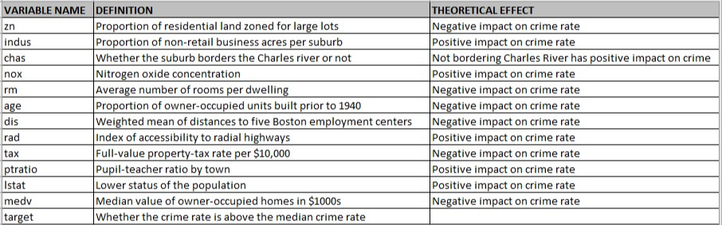

Source code: [https://github.com/djlofland/DS621_F2020_Group3/tree/master/Homework_3](https://github.com/djlofland/DS621_F2020_Group3/tree/master/Homework_3)

```{r setup, include=FALSE}
knitr::opts_chunk$set(echo = FALSE, warning = FALSE, include=TRUE)
```

```{r paged.print=FALSE,  include=FALSE}
library(MASS)
library(rpart.plot)
library(ggplot2)
library(ggfortify)
library(gridExtra)
library(forecast)
library(fpp2)
library(fma)
library(kableExtra)
library(e1071)
library(mlbench)
library(ggcorrplot)
library(DataExplorer)
library(timeDate)
library(caret)
library(GGally)
library(corrplot)
library(RColorBrewer)
library(tibble)
library(tidyr)
library(tidyverse)
library(dplyr)
library(reshape2)
library(mixtools)
library(tidymodels)
library(ggpmisc)
library(regclass)
library(pROC)

#' Print a side-by-side Histogram and QQPlot of Residuals
#'
#' @param model A model
#' @examples
#' residPlot(myModel)
#' @return null
#' @export
residPlot <- function(model) {
  # Make sure a model was passed
  if (is.null(model)) {
    return
  }
  
  layout(matrix(c(1,1,2,3), 2, 2, byrow = TRUE))
  plot(residuals(model))
  hist(model[["residuals"]], freq = FALSE, breaks = "fd", main = "Residual Histogram",
       xlab = "Residuals",col="lightgreen")
  lines(density(model[["residuals"]], kernel = "ep"),col="blue", lwd=3)
  curve(dnorm(x,mean=mean(model[["residuals"]]), sd=sd(model[["residuals"]])), col="red", lwd=3, lty="dotted", add=T)
  qqnorm(model[["residuals"]], main = "Residual Q-Q plot")
  qqline(model[["residuals"]],col="red", lwd=3, lty="dotted")
  par(mfrow = c(1, 1))
}

#' Print a Variable Importance Plot for the provided model
#'
#' @param model The model
#' @param chart_title The Title to show on the plot
#' @examples
#' variableImportancePlot(myLinearModel, 'My Title)
#' @return null
#' @export
variableImportancePlot <- function(model=NULL, chart_title='Variable Importance Plot') {
  # Make sure a model was passed
  if (is.null(model)) {
    return
  }
  
  # use caret and gglot to print a variable importance plot
  varImp(model) %>% as.data.frame() %>% 
    ggplot(aes(x = reorder(rownames(.), desc(Overall)), y = Overall)) +
    geom_col(aes(fill = Overall)) +
    theme(panel.background = element_blank(),
          panel.grid = element_blank(),
          axis.text.x = element_text(angle = 90)) +
    scale_fill_gradient() +
    labs(title = chart_title,
         x = "Parameter",
         y = "Relative Importance")
}


#' Print a Facet Chart of histograms
#'
#' @param df Dataset
#' @param box Facet size (rows)
#' @examples
#' histbox(my_df, 3)
#' @return null
#' @export
histbox <- function(df, box) {
    par(mfrow = box)
    ndf <- dimnames(df)[[2]]
    
    for (i in seq_along(ndf)) {
            data <- na.omit(unlist(df[, i]))
            hist(data, breaks = "fd", main = paste("Histogram of", ndf[i]),
                 xlab = ndf[i], freq = FALSE)
            lines(density(data, kernel = "ep"), col = 'red')
    }
    
    par(mfrow = c(1, 1))
}

#' Extract key performance results from a model
#'
#' @param model A linear model of interest
#' @examples
#' model_performance_extraction(my_model)
#' @return data.frame
#' @export
model_performance_extraction <- function(model=NULL) {
  # Make sure a model was passed
  if (is.null(model)) {
    return
  }
  
  data.frame("RSE" = model$sigma,
             "Adj R2" = model$adj.r.squared,
             "F-Statistic" = model$fstatistic[1])
}

#' Return a properly rounded Box Cox lambda (-n, ..., -1, -0.5, 0, 1, ..., n)
#'
#' @param series A time series
#' @examples
#' round_lambda(my_series)
#' @return new_lambda
#' @export
round_lambda <- function(series) {
  lambda <- BoxCox.lambda(series)
  
  if ((lambda > 0.25) & (lambda < 0.75)) {
    new_lambda <- 0.5
  } else if ((lambda > -0.75) & (lambda < -0.25)) {
    new_lambda <- -0.5
  } else {
    new_lambda <- round(lambda)
  }

  print(paste('lambda:', lambda, ',  rounded lambda:', new_lambda))
  
  return(new_lambda)
}

```

## Instructions

### Overview

In this homework assignment, you will explore, analyze, and model a data set containing information on crime for various neighborhoods of a major city. Each record has a response variable indicating whether or not the crime rate is above the median crime rate (1) or not (0).

Your objective is to build a binary logistic regression model on the training data set to predict whether the neighborhood will be at risk for high crime levels. You will provide classifications and probabilities for the evaluation data set using your binary logistic regression model. You can only use the variables given to you (or variables that you derive from the variables provided). Below is a short description of the variables of interest in the data set:

* `zn`: the proportion of residential land zoned for large lots (over 25000 square feet) (predictor variable)
* `indus`: the proportion of non-retail business acres per suburb (predictor variable)
* `chas`: a dummy var. for whether the suburb borders the Charles River (1) or not (0) (predictor variable)
* `nox`: nitrogen oxides concentration (parts per 10 million) (predictor variable)
* `rm`: average number of rooms per dwelling (predictor variable)
* `age`: the proportion of owner-occupied units built prior to 1940 (predictor variable)
* `dis`: weighted mean of distances to five Boston employment centers (predictor variable)
* `rad`: index of accessibility to radial highways (predictor variable)
* `tax`: full-value property-tax rate per $10,000 (predictor variable)
* `ptratio`: pupil-teacher ratio by town (predictor variable)
* `lstat`: lower status of the population (percent) (predictor variable)
* `medv`: median value of owner-occupied homes in $1000s (predictor variable)
* `target`: whether the crime rate is above the median crime rate (1) or not (0) (response variable)

### Deliverables

* A write-up submitted in PDF format. Your write-up should have four sections. Each one is described below. You may assume you are addressing me as a fellow data scientist, so do not need to shy away from technical details.
* Assigned prediction (probabilities, classifications) for the evaluation data set. Use a 0.5 threshold.
* Include your R statistical programming code in an Appendix.

## Introduction

Crime is a common concern in large cities, and denizens, policymakers, and law enforcement are interested in identifying locations where crime can or might occur. In this assignment, we are given a dataset for the city of Boston and will build a model to identify regions that might have higher or lower (against the median) crime. Since the goal is a binary (above or below median) response, this assignment will employ binary logistic regression--and will not be predicting an actual value, like the Moneyball assignment. 


## 1. Data Exploration

*Describe the size and the variables in the crime training data set. Consider that too much detail will cause a manager to lose interest while too little detail will make the manager consider that you aren’t doing your job. Some suggestions are given below. Please do NOT treat this as a checklist of things to do to complete the assignment. You should have your own thoughts on what to tell the boss. These are just ideas.*

### Dataset

The dataset is notably different from Assignment 1's Moneyball regression dataset in two ways: It contains both a categorical target and provides some categorical features. The fact that we are provided with a categorical target turns the task from a regression task to a classification task, perfect for logistic regression. The data contains 12 features and 466 instances, with 40 instances reserved for an evaluation dataset with targets removed.

There are two files provided:

* **crime-training-data_modified.csv** - hold data from training a model
* **crime-evaluation-data_modified.csv** - holdout data used for evaluation.  Note this dataset doesn't include the target column so while we can predict classes, our model will have to be scored by an outside group with knowledge of the actual classes.

```{r load_data}
# Load crime dataset
df <- read.csv('datasets/crime-training-data_modified.csv')
df_eval <- read.csv('datasets/crime-evaluation-data_modified.csv')
```

Below, we created a chart that describes each variable in the dataset and the theoretical effect it will have on the crime rate.



### Summary Stats

We compiled summary statistics on our dataset to better understand the data before modeling. 

```{r columnsE}
# Display summary statistics
summary(df)
```

The first observation is that we have no missing data (coded as NA's).

Based on the summary statistics, it appears we have some highly skewed features, as many features have means that are far from the median indicating a skewed distribution. Some examples include the variables `zn` and `tax`. We also see a categorical variable `chas` that appears to be quite imbalanced, as over 75% of values are 0.

### Check Class Bias

We have two target values, `0` and `1`.  When building models, we ideally want an equal representation of both classes.  As class imbalance deviates, our model performance will suffer both form effects of differential variance between the classes and bias towards picking the more represented class.  For logistic regression, if we see a strong imbalance, we can:

+ up-sample the smaller group (e.g. Bootstrapping),
+ down-sample the larger group (e.g. Sampling or Bootstrapping),
+ or adjust our threshold for assigning the predicted value away from 0.5.

Our class balance is:

```{r}
class_proportion = colMeans(df['target'])
class_proportion
```

The classes are quite balanced, with approximately 51% `0`'s and 49% `1`'s. This is helpful, as with unbalanced class distributions it is often necessary to artificially balance the classes to achieve good results. No upsampling or downsampling will be required to achieve class balance with this dataset.

### Distributions

Next, we visualize the distribution profiles for each of the predictor variables. This will help us to make a plan on which variable to include, how they might be related to each other or the target, and finally identify outliers or transformations that might help improve model resolution.

```{r, fig.height = 10, fig.width = 10, echo=FALSE}
# Prepare data for ggplot
gather_df <- df %>% dplyr::select(-target) %>%
  gather(key = 'variable', value = 'value')

# Histogram plots of each variable
ggplot(gather_df) + 
  geom_histogram(aes(x=value, y = ..density..), bins=30) + 
  geom_density(aes(x=value), color='blue') +
  facet_wrap(. ~variable, scales='free', ncol=3)
```

The distribution profiles show the prevalence of kurtosis, specifically right skew in variables `dis`, `lstat`, `nox`, `rm`, `zn`, and left skew in `age` and `ptratio`. These deviations from a traditional normal distribution can be problematic for linear regression assumptions, and thus we might need to transform the data.  The feature `chas` is binary, as it only assumes values of `0` or `1`.  Furthermore, the features `tax`, `rad`, and possibly `indus` appear bimodal. Bimodal features in a dataset are both problematic and interesting and potentially an area of opportunity and exploration.  Bimodal data suggests that there are possibly two different groups or classes within the feature.

Bimodal features are extremely interesting in classification tasks, as they could indicate overlapping but separate distributions for each class, which could provide powerful predictive power in a model.

While we don't tackle feature engineering in this analysis, if we were performing a more in-depth analysis, we could leverage the package, `mixtools` (see R Vignette).  This package helps regress *mixed models* where data can be subdivided into subgroups. 

Here is a quick example showing a possible mix within `indis`:

```{r}
# Select indus column and remove any missing data
df_mix <- df %>% 
  dplyr::select(indus)

# Calculate mixed distributions for indus
indus_so_mix <- normalmixEM(df_mix$indus, 
                            lambda = .5, 
                            mu = c(5, 20), 
                            sigma = 1, 
                            maxit=60)

# Simple plot to illustrate possible bimodal mix of groups
plot(indus_so_mix, 
     whichplots = 2,
     density = TRUE, 
     main2 = "`indus` Possible Distributions", 
     xlab2 = "indus")
```

Lastly, several features have both a distribution along with a high number of values at an extreme. However, based on the feature meanings and provided information, there is no reason to believe that any of these extreme values are mistakes, data errors, or otherwise inexplicable. As such, we will not remove the extreme values, as they represent valuable data and could be predictive of the target.

### Boxplots

In addition to creating histogram distributions, we also elected to use box-plots to get an idea of the spread of each variable. 

```{r, fig.height = 10, fig.width = 10, echo=FALSE}
# Prepare data for ggplot
gather_df <- df %>% dplyr::select(-target) %>%
  gather(key = 'variable', value = 'value')

# Boxplots for each variable
ggplot(gather_df, aes(variable, value)) + 
  geom_boxplot() + 
  facet_wrap(. ~variable, scales='free', ncol=6)
```

The box-plots reveal significant outliers that may need to be imputed if necessary.

### Variable Plots

Finally, we generate scatter plots of each variable versus the target variable to get an idea of the relationship between them. 

```{r, fig.height = 10, fig.width = 10, echo=FALSE}
# Plot scatter plots of each variable versus the target variable
featurePlot(df[,1:ncol(df)-1], df[,ncol(df)], pch = 20)
```

Although it does not appear that any one feature clearly distinguishes the two target values, there are many features that appear to have some significant correlation with the target, including `lstat`, `age`, `dis`, `zn`, and `nox`. This indicates that our data may be predictive and the model building process is likely to model an actual relationship rather than just overfitting to the quirks of the training data.

### Missing Data

Fortunately, we see no NAs, or missing data in the provided training dataset.

```{r echo=FALSE} 
# Identify missing data by Feature and display percent breakout
missing <- colSums(df %>% sapply(is.na))
missing_pct <- round(missing / nrow(df) * 100, 2)
stack(sort(missing_pct, decreasing = TRUE))
```

### Handle Outliers

```{r echo=F}
clean_df <- df
```

As mentioned above, for this task we chose not to remove outliers as there was no reason to believe that any of the values were in error.

### Feature-Target Correlations

With our outliers data imputed correctly, we can now build plots to quantify the correlations between our target variable and predictor variable. We will want to choose those with stronger positive or negative correlations.  Features with correlations closer to zero will probably not provide any meaningful information on explaining crime patterns.

```{r echo=FALSE}
# Show feature correlations/target by decreasing correlation
stack(sort(cor(df[,13], df[,1:ncol(df)-1])[,], decreasing=TRUE))
```

It appears that `nox`, `age`, `rad`, `tax`, and `indus` have the highest correlation (positive) with `target`; this appears to be somewhat counterintuitive, as older buildings, more residential neighborhoods, and higher property tax values appear to lead to higher crime, not what was expected. The strong positive correlation with nitrous oxide (`nox`)is also interesting and unexpected. The other variables have a weak or slightly negative correlation, which implies they have less predictive power.

`dis`, `zn`, and `medv` all have a negative correlation to `target`, indicating that more distant areas with large lot sizes and high median home values are less likely to be high crime, all of which seem sensible.

### Multicollinearity

One problem that can occur with multi-variable regression is a correlation between variables, called Multicollinearity.  A quick check is to run correlations between variables.   

```{r echo=FALSE}
# Calculate and plot the Multicolinearity
correlation = cor(clean_df, use = 'pairwise.complete.obs')

corrplot(correlation, 'ellipse', type = 'lower', order = 'hclust',
         col=brewer.pal(n=8, name="RdYlBu"))
```

We can see that some variables are highly correlated with one another, such as `tax` and `rad`, with a correlation between .75 and 1. When we start considering features for our models, we'll need to account for the correlations between features and avoid including pairs with strong correlations.

As a note, this dataset is challenging as many of the predictive features go hand-in-hand with other features and multicolinearity will be a problem. Home size, price, age, and distance from employment centers could all potentially be related, so it makes sense to see some collinearity in the features.

## 2. Data Preparation

To summarize our data preparation and exploration, we can distinguish our findings into a few categories below:

### Removed Fields

All the predictor variables have no missing values and show no indication of incomplete or incorrect data. As such, we have kept all the fields.

### Missing Values

The data had no missing values to remove.

### Outliers

No outliers were removed as all values seemed reasonable. 

### Transform non-normal variables

Finally, as mentioned earlier in our data exploration, and our findings from our histogram plots, we can see that some of our variables are highly skewed. To address this, we decided to perform some transformations to make them more normally distributed. Here are some plots to demonstrate the changes in distributions before and after the transformations:  

```{r, echo=FALSE, fig.height=14, fig.width=8, message=FALSE, warning=FALSE}

# created empty data frame to store transformed variables
df_temp <- data.frame(matrix(ncol = 1, nrow = length(clean_df$target)))

# performed boxcox transformation after identifying proper lambda
df_temp$rm <- clean_df$rm
rm_lambda <- BoxCox.lambda(clean_df$rm)
df_temp$rm_transform <- BoxCox(clean_df$rm, rm_lambda)

df_temp$nox <- clean_df$nox
nox_lambda <- BoxCox.lambda(clean_df$nox)
df_temp$nox_transform <- BoxCox(clean_df$nox, nox_lambda)

df_temp$dis <- clean_df$dis
df_temp$dis_transform <- log(clean_df$dis)

df_temp$zn <- clean_df$zn
df_temp$zn_transform <- log(clean_df$zn+1)

df_temp$lstat <- clean_df$lstat
df_temp$lstat_transform <- log(clean_df$lstat)

df_temp$age <- clean_df$age
df_temp$age_transform <- log(max(clean_df$age) + 1 - clean_df$age)

df_temp$ptratio <- clean_df$ptratio
df_temp$ptratio_transform <- log(max(clean_df$ptratio) + 1 - clean_df$ptratio)

df_temp <- df_temp[, 2:15]

histbox(df_temp, c(8, 2))
```

### Finalizing the dataset for model building 

With our transformations complete, we can now add these into our `clean_df` dataframe and continue on to build our models.

```{r}
# Build clean dataframe with transformation

clean_df <- data.frame(cbind(clean_df, 
                        rm_transform = df_temp$rm_transform,
                        nox_transform = df_temp$nox_transform,
                        dis_transform = df_temp$dis_transform,
                        zn_transform = df_temp$zn_transform,
                        lstat_transform = df_temp$lstat_transform,
                        age_transform = df_temp$age_transform,
                        ptratio_transform = df_temp$ptratio_transform
                        ))

is.na(clean_df) <- sapply(clean_df, is.infinite)
```

## 3. Build Models

*Using the training data, build at least three different binary logistic regression models, using different variables (or the same variables with different transformations). You may select the variables manually, use an approach such as Forward or Stepwise, use a different approach, or use a combination of techniques. Describe the techniques you used. If you manually selected a variable for inclusion into the model or exclusion into the model, indicate why this was done.* 
*Be sure to explain how you can make inferences from the model, as well as discuss other relevant model output. Discuss the coefficients in the models, do they make sense? Are you keeping the model even though it is counter-intuitive? Why? The boss needs to know.* 

### Model-building methodology  

With a solid understanding of our dataset at this point, and with our data cleaned, we can now start to build out some of our binary logistic regression models.  

First, we decided to split our cleaned dataset into a training and testing set (80% training, 20% testing). This was necessary as the provided holdout evaluation dataset doesn't provide `target` values so we cannot measure our model performance against that dataset.  

```{r}
set.seed(123456)

# utilizing one dataset for all four models
cleaneddfTrain <- createDataPartition(clean_df$target, p=0.8, list=FALSE)
cleaneddftraining <- clean_df[cleaneddfTrain,]
cleaneddftesting <- clean_df[-cleaneddfTrain,]
```

#### Model #1 *(Raw Features)*

Using our training dataset, we decided to run a binary logistic regression model that included all non-transformed features that we hadn't removed following our data cleaning process mentioned above. 

```{r}
model1 <- glm(target ~ zn + indus + chas + nox + rm + age + dis + rad + tax + ptratio + lstat + medv, data = cleaneddftraining , family = binomial)
summary(model1)
```

We also calculated *VIF scores* to measure the effects of collinearity as well as variable importance:

```{r fig.height=3, fig.width=6}
# print variable inflation factor score
print('VIF scores of predictors')

VIF(model1)
variableImportancePlot(model1)
```


#### Model #2 *(Transformed Features)*

*Model #2* was built using our transformed features. 

```{r}
model2 <- glm(target ~ zn_transform + indus + chas + nox_transform + rm_transform + age_transform + dis_transform + rad + tax + ptratio_transform + lstat_transform + medv, data = cleaneddftraining , family = binomial)
summary(model2)
```

We also calculated *VIF scores* to measure the effects of collinearity as well as variable importance:

```{r fig.height=3, fig.width=6}
# print variable inflation factor score
print('VIF scores of predictors')

VIF(model2)
variableImportancePlot(model2)
```

#### Model #3 *(Stepwise-AIC on Model #1)*

In our next model, we used a *Stepwise AIC* on *Model #1* (our model with non-transformed features) to pick which features were most relevant.

```{r}
model3 <- model1 %>% stepAIC(trace = FALSE)
summary(model3)
```

We also calculated *VIF scores* to measure the effects of collinearity as well as variable importance:

```{r fig.height=3, fig.width=6}
# print variable inflation factor score
print('VIF scores of predictors')

VIF(model3)
variableImportancePlot(model3)
```

#### Model #4 *(Stepwise-AIC on Model #2)*

In our final model, we applied *Stepwise AIC* on *Model #2* (our model with transformed features) to pick which features were most relevant.

```{r}
model4 <- model2 %>% stepAIC(trace = FALSE)
summary(model4)
```

We also calculated *VIF scores* to measure the effects of collinearity as well as variable importance:

```{r fig.height=3, fig.width=6}
# print variable inflation factor score
print('VIF scores of predictors')

VIF(model4)
variableImportancePlot(model4)
```

### Examining our model coefficients  

Throughout our model-building process, we noticed that many of our model outputs yielded a few coefficient values that seemed to contradict our initial estimates. For instance, in *Model #1*:  

**Positive values for coefficients that we'd expect to be negative**  

+ **age** - logically we thought that the higher the proportion of owner-occupied units built prior to 1940 would lead to a lower crime rate (historic homes with more property value)
+ **dis** - logically we thought that the higher the weighted mean value of distance to five Boston employment centers, the lower the crime rate (areas farther from employment centers indicated there is less of a need for them -- higher rates of employment) 
+ **medv** - logically we thought the higher the median value of owner-occupied homes in $1000s would lead to a lower crime rate


This is a trend we saw throughout the four models that we built, although *Models #3* and *Model #4* were able to adjust for this better than our first two models -- we can likely attribute this phenomenon to multicollinearity. Since we noticed in our initial data exploration that many variables in the dataset were highly correlated with one another (i.e. `medv` and `zn`, `nox` and `indus`, `tax` and `rad`), this phenomenon likely is increasing the variance of the coefficient estimates, making them difficult to interpret (and in some cases such as the features listed above, they are switching the signs). This was also supported by our Variance Inflation Factor (VIF) tests, which showed high values for features such as [`medv` and `rn`]. In our final models (Models #3 and #4), we made sure to keep this in mind in order to get a better handle on our coefficients and reduce multicollinearity -- mainly, we removed certain variables that had high VIF scores through our stepwise selection process. 

## 4. Model Selection & Analysis 

*For the binary logistic regression model, will you use a metric such as log-likelihood, AIC, ROC curve, etc.? Using the training data set, evaluate the binary logistic regression model based on (a) accuracy, (b) classification error rate, (c) precision, (d) sensitivity, (e) specificity, (f) F1 score, (g) AUC, and (h) confusion matrix. Make predictions using the evaluation data set.*

### Confusion Matrices

*Model #1* Confusion Matrix:

```{r, echo=FALSE}
model1_glm_pred = ifelse(predict(model1, type = "link") > 0.5, "Yes", "No")

cleaneddftesting$model1 <- ifelse(predict.glm(model1, cleaneddftesting, "response") >= 0.5, 1, 0)
cm1 <- confusionMatrix(factor(cleaneddftesting$model1), factor(cleaneddftesting$target), "1")
results <- tibble(Model = "Model #1", Accuracy=cm1$byClass[11], F1 = cm1$byClass[7],
                  Deviance= model1$deviance, 
                  R2 = 1 - model1$deviance / model1$null.deviance,
                  AIC= model1$aic)
cm1
```

*Model #2* Confusion Matrix:

```{r}
model2_glm_pred = ifelse(predict(model2, type = "link") > 0.5, "Yes", "No")

cleaneddftesting$model2 <- ifelse(predict.glm(model2, cleaneddftesting, "response") >= 0.5, 1, 0)
cm2 <- confusionMatrix(factor(cleaneddftesting$model2), factor(cleaneddftesting$target), "1")
results <- rbind(results, tibble(Model = "Model #2", Accuracy=cm2$byClass[11], F1 = cm2$byClass[7],
                  Deviance= model2$deviance, 
                  R2 = 1 - model2$deviance / model2$null.deviance,
                  AIC= model2$aic))
cm2
```

*Model #3* Confusion Matrix:

```{r}
model3_glm_pred = ifelse(predict(model3, type = "link") > 0.5, "Yes", "No")

cleaneddftesting$model3 <- ifelse(predict.glm(model3, cleaneddftesting,"response") >= 0.5, 1, 0)
cm3 <- confusionMatrix(factor(cleaneddftesting$model3), factor(cleaneddftesting$target), "1")
results <- rbind(results, tibble(Model = "Model #3", Accuracy=cm3$byClass[11], F1 = cm3$byClass[7],
                  Deviance=model3$deviance, 
                  R2 = 1 - model3$deviance / model3$null.deviance,
                  AIC=model3$aic))
cm3
```

*Model #4* Confusion Matrix:

```{r}
model4_glm_pred = ifelse(predict(model4, type = "link") > 0.5, "Yes", "No")

cleaneddftesting$model4 <- ifelse(predict.glm(model4, cleaneddftesting,"response") >= 0.5, 1, 0)
cm4 <- confusionMatrix(factor(cleaneddftesting$model4), factor(cleaneddftesting$target), "1")
results <- rbind(results, tibble(Model = "Model #4", Accuracy=cm4$byClass[11], F1 = cm4$byClass[7],
                  Deviance=model4$deviance, 
                  R2 = 1 - model4$deviance / model4$null.deviance,
                  AIC=model4$aic))
cm4
```

### ROC Curves

A Comparison of ROC Curves for each model, *Model #1* ... *Model #4*:

```{r, message=FALSE, warning=FALSE}
# par(pty = "s")
print('Model #1 ROC Curve')
roc(cleaneddftesting[["target"]], cleaneddftesting[["model1"]], plot = TRUE, legacy.axes = TRUE, print.auc = TRUE)

print('Model #2 ROC Curve')
roc(cleaneddftesting[["target"]], cleaneddftesting[["model2"]], plot = TRUE, legacy.axes = TRUE, print.auc = TRUE)

print('Model #3 ROC Curve')
roc(cleaneddftesting[["target"]], cleaneddftesting[["model3"]], plot = TRUE, legacy.axes = TRUE, print.auc = TRUE)

print('Model #4 ROC Curve')
roc(cleaneddftesting[["target"]], cleaneddftesting[["model4"]], plot = TRUE, legacy.axes = TRUE, print.auc = TRUE)
```

### Model Performance Summary

The following table discusses each of the model performance metrics on the training dataset. These values indicate there is a minor improvement in model performance after applying transformations and selecting for significant parameters.  

```{r}
kable(results) %>% 
  kable_styling(bootstrap_options = "basic", position = "center")
```

The above table summarizes the *accuracy*, *F-statistic*, *deviance*, *$R^2$* (McFaden) and *AIC* of all of our models. 

In terms of absolute metrics: 

*Model #1* had the highest *accuracy* and *F-statistic*.
*Model #2 *had the highest *$R^2$* (Mcfaden psuedo) and lowest *deviance*.
*Model #4* had the lowest *AIC.* 

Recall that *Model #1 * consisted of the untransformed data. *Model #2* was transformed data. *Model #3* and *Model #4* were *Stepwise AIC* optimizations of said models. 

When looking at *Model #1* vs *Model #2*--while Model #1 had higher accuracy, and essentially the same F-statistics, Model #2 had lower *deviance* and *AIC*, and higher *$R^2$*. This shows that *Model #2* was of higher quality and fit, with less error than *Model #1*, albeit slightly less accurate. 

Looking at *Model #1* vs *Model #3* we see that *Model #1* had a high *Accuracy*,* F-statistic*, lower *deviance*, and higher *$R^2$*  than *Model #3*. *Model #3* had a lower *AIC*--but this is to be expected as it's an optimized *AIC* of *Model #1*. This result is interesting as it shows that while *Model #3* is a higher quality (lower *AIC*), it doesn't have stronger predictive power (*$R^2$* and *deviation.*)

*Model #2* and *Model #4* shared the same *accuracy* and *F1*, and differed slightly in *deviance*, *$R^2$*, and *AIC*--this was expected since *Model #4* is a *Stepwise-AIC* optimization.

Finally comparing *Model #3* and *Model #4*, we can make the same generalizations from *Model #1* and *Model #2*, since both models are the basis--*Model #4* was of better quality/fit with less deviation, albeit slightly less accurate. 

```{r}
# created empty data frame to store transformed variables
df_temp_eval <- data.frame(matrix(ncol = 1, nrow = length(df_eval$medv)))

# performed boxcox transformation after identifying proper lambda
df_temp_eval$rm <- df_eval$rm
rm_lambda <- BoxCox.lambda(df_eval$rm)
df_temp_eval$rm_transform <- BoxCox(df_eval$rm, rm_lambda)

df_temp_eval$nox <- df_eval$nox
nox_lambda <- BoxCox.lambda(df_eval$nox)
df_temp_eval$nox_transform <- BoxCox(df_eval$nox, nox_lambda)

df_temp_eval$dis <- df_eval$dis
df_temp_eval$dis_transform <- log(df_eval$dis)

df_temp_eval$zn <- df_eval$zn
df_temp_eval$zn_transform <- log(df_eval$zn+1)

df_temp_eval$lstat <- df_eval$lstat
df_temp_eval$lstat_transform <- log(df_eval$lstat)

df_temp_eval$age <- df_eval$age
df_temp_eval$age_transform <- log(max(df_eval$age) + 1 - df_eval$age)

df_temp_eval$ptratio <- df_eval$ptratio
df_temp_eval$ptratio_transform <- log(max(df_eval$ptratio) + 1 - df_eval$ptratio)

df_temp_eval <- df_temp_eval[, 2:15]
```


```{r}
# Build clean dataframe with transformation

df_eval <- data.frame(cbind(df_eval, 
                        rm_transform = df_temp_eval$rm_transform,
                        nox_transform = df_temp_eval$nox_transform,
                        dis_transform = df_temp_eval$dis_transform,
                        zn_transform = df_temp_eval$zn_transform,
                        lstat_transform = df_temp_eval$lstat_transform,
                        age_transform = df_temp_eval$age_transform,
                        ptratio_transform = df_temp_eval$ptratio_transform
                        ))

is.na(df_eval) <- sapply(df_eval, is.infinite)
```


## Model of choice  

Based on all of our models we gave the edge to* Model #2* and *Model #4*, given that they fit the data (Higher *$R^2$*, lower *AIC*, lower *deviance*) better than their counterparts. 

Ultimately when choosing between both models--we chose **Model #4** as all thing equal (which they shared *accuracy*, *F-statistic*, and *McFaden R-squared*), it had a lower *AIC*, and therefore was a higher quality model. 

## Predictions

We apply **Model #4** to the holdout evaluation set to predict the targets for these 40 instances. We have saved these predictions as csv in the file `eval_predictions.csv`.

Source code: [https://github.com/djlofland/DS621_F2020_Group3/tree/master/Homework_3/eval_predictions.csv](https://github.com/djlofland/DS621_F2020_Group3/tree/master/Homework_3/eval_predictions.csv)

```{r, echo=F}
eval_data <- df_eval %>% select(c(zn_transform, indus, chas, nox_transform, rm_transform, age_transform, dis_transform, rad, tax, ptratio_transform, lstat_transform, medv))
predictions <- ifelse(predict(model4, eval_data, type = "link") > 0.5, 1, 0)
df_eval['target'] <- predictions

write.csv(df_eval, 'eval_predictions.csv', row.names=F)
predictions
```

## References

- A Modern Approach to Regression with R: Simon Sheather
- Linear Models with R: Julian Faraway. 
- R package vignette, [mixtools: An R Package for Analyzing Finite Mixture Models](https://cran.r-project.org/web/packages/mixtools/vignettes/mixtools.pdf)
- [7 Classic OLS assumptions](https://statisticsbyjim.com/regression/ols-linear-regression-assumptions/)
- [Detecting Multicolinearity with VIF](https://online.stat.psu.edu/stat462/node/180/)


## Appendix

### A. Crime Dataset Columns

- [Group 3 HW  3 GitHub](https://github.com/djlofland/DS621_F2020_Group3/tree/master/Homework_3)
  
### R Code

```
# =====================================================================================
# Load Libraries and Define Helper functions 
# =====================================================================================

library(MASS)
library(rpart.plot)
library(ggplot2)
library(ggfortify)
library(gridExtra)
library(forecast)
library(fpp2)
library(fma)
library(kableExtra)
library(e1071)
library(mlbench)
library(ggcorrplot)
library(DataExplorer)
library(timeDate)
library(caret)
library(GGally)
library(corrplot)
library(RColorBrewer)
library(tibble)
library(tidyr)
library(tidyverse)
library(dplyr)
library(reshape2)
library(mixtools)
library(tidymodels)
library(ggpmisc)
library(regclass)
library(pROC)

#' Print a side-by-side Histogram and QQPlot of Residuals
#'
#' @param model A model
#' @examples
#' residPlot(myModel)
#' @return null
#' @export
residPlot <- function(model) {
  # Make sure a model was passed
  if (is.null(model)) {
    return
  }
  
  layout(matrix(c(1,1,2,3), 2, 2, byrow = TRUE))
  plot(residuals(model))
  hist(model[["residuals"]], freq = FALSE, breaks = "fd", main = "Residual Histogram",
       xlab = "Residuals",col="lightgreen")
  lines(density(model[["residuals"]], kernel = "ep"),col="blue", lwd=3)
  curve(dnorm(x,mean=mean(model[["residuals"]]), sd=sd(model[["residuals"]])), col="red", lwd=3, lty="dotted", add=T)
  qqnorm(model[["residuals"]], main = "Residual Q-Q plot")
  qqline(model[["residuals"]],col="red", lwd=3, lty="dotted")
  par(mfrow = c(1, 1))
}

#' Print a Variable Importance Plot for the provided model
#'
#' @param model The model
#' @param chart_title The Title to show on the plot
#' @examples
#' variableImportancePlot(myLinearModel, 'My Title)
#' @return null
#' @export
variableImportancePlot <- function(model=NULL, chart_title='Variable Importance Plot') {
  # Make sure a model was passed
  if (is.null(model)) {
    return
  }
  
  # use caret and gglot to print a variable importance plot
  varImp(model) %>% as.data.frame() %>% 
    ggplot(aes(x = reorder(rownames(.), desc(Overall)), y = Overall)) +
    geom_col(aes(fill = Overall)) +
    theme(panel.background = element_blank(),
          panel.grid = element_blank(),
          axis.text.x = element_text(angle = 90)) +
    scale_fill_gradient() +
    labs(title = chart_title,
         x = "Parameter",
         y = "Relative Importance")
}


#' Print a Facet Chart of histograms
#'
#' @param df Dataset
#' @param box Facet size (rows)
#' @examples
#' histbox(my_df, 3)
#' @return null
#' @export
histbox <- function(df, box) {
    par(mfrow = box)
    ndf <- dimnames(df)[[2]]
    
    for (i in seq_along(ndf)) {
            data <- na.omit(unlist(df[, i]))
            hist(data, breaks = "fd", main = paste("Histogram of", ndf[i]),
                 xlab = ndf[i], freq = FALSE)
            lines(density(data, kernel = "ep"), col = 'red')
    }
    
    par(mfrow = c(1, 1))
}

#' Extract key performance results from a model
#'
#' @param model A linear model of interest
#' @examples
#' model_performance_extraction(my_model)
#' @return data.frame
#' @export
model_performance_extraction <- function(model=NULL) {
  # Make sure a model was passed
  if (is.null(model)) {
    return
  }
  
  data.frame("RSE" = model$sigma,
             "Adj R2" = model$adj.r.squared,
             "F-Statistic" = model$fstatistic[1])
}


# =====================================================================================
# Load Data set
# =====================================================================================

# Load crime dataset
df <- read.csv('datasets/crime-training-data_modified.csv')
df_eval <- read.csv('datasets/crime-evaluation-data_modified.csv')

# =====================================================================================
# Summary Stats 
# =====================================================================================

# Display summary statistics
summary(df)

# =====================================================================================
# Check Class Bias 
# =====================================================================================

class_proportion = colMeans(df['target'])
class_proportion

# =====================================================================================
# Distributions 
# =====================================================================================

# Prepare data for ggplot
gather_df <- df %>% dplyr::select(-target) %>%
  gather(key = 'variable', value = 'value')

# Histogram plots of each variable
ggplot(gather_df) + 
  geom_histogram(aes(x=value, y = ..density..), bins=30) + 
  geom_density(aes(x=value), color='blue') +
  facet_wrap(. ~variable, scales='free', ncol=3)
     
# =====================================================================================
# Boxplots 
# =====================================================================================

# Prepare data for ggplot
gather_df <- df %>% dplyr::select(-target) %>%
  gather(key = 'variable', value = 'value')

# Boxplots for each variable
ggplot(gather_df, aes(variable, value)) + 
  geom_boxplot() + 
  facet_wrap(. ~variable, scales='free', ncol=6)

# =====================================================================================
# Variable Plots
# =====================================================================================
  
# Plot scatter plots of each variable versus the target variable
featurePlot(df[,1:ncol(df)-1], df[,ncol(df)], pch = 20)


# =====================================================================================
# Missing Data 
# =====================================================================================

# Identify missing data by Feature and display percent breakout
missing <- colSums(df %>% sapply(is.na))
missing_pct <- round(missing / nrow(df) * 100, 2)
stack(sort(missing_pct, decreasing = TRUE))

# =====================================================================================
# Handle Outliers
# =====================================================================================

clean_df <- df


# =====================================================================================
# Feature-Target Correlations 
# =====================================================================================

# Show feature correlations/target by decreasing correlation
stack(sort(cor(df[,13], df[,1:ncol(df)-1])[,], decreasing=TRUE))

# =====================================================================================
# Multicolinearity 
# =====================================================================================

# Calculate and plot the Multicolinearity
correlation = cor(clean_df, use = 'pairwise.complete.obs')

corrplot(correlation, 'ellipse', type = 'lower', order = 'hclust',
         col=brewer.pal(n=8, name="RdYlBu"))

# =====================================================================================
# Transform non-normal variables 
# =====================================================================================
         
# created empty data frame to store transformed variables
df_temp <- data.frame(matrix(ncol = 1, nrow = length(clean_df$target)))

# performed boxcox transformation after identifying proper lambda
df_temp$rm <- clean_df$rm
rm_lambda <- BoxCox.lambda(clean_df$rm)
df_temp$rm_transform <- BoxCox(clean_df$rm, rm_lambda)

df_temp$nox <- clean_df$nox
nox_lambda <- BoxCox.lambda(clean_df$nox)
df_temp$nox_transform <- BoxCox(clean_df$nox, nox_lambda)

df_temp$dis <- clean_df$dis
df_temp$dis_transform <- log(clean_df$dis)

df_temp$zn <- clean_df$zn
df_temp$zn_transform <- log(clean_df$zn+1)

df_temp$lstat <- clean_df$lstat
df_temp$lstat_transform <- log(clean_df$lstat)

df_temp$age <- clean_df$age
df_temp$age_transform <- log(max(clean_df$age) + 1 - clean_df$age)

df_temp$ptratio <- clean_df$ptratio
df_temp$ptratio_transform <- log(max(clean_df$ptratio) + 1 - clean_df$ptratio)

df_temp <- df_temp[, 2:15]

histbox(df_temp, c(6, 2))

# =====================================================================================
# Final Cleaned Dataframe with transformations
# =====================================================================================

clean_df <- data.frame(cbind(clean_df, 
                        rm_transform = df_temp$rm_transform,
                        nox_transform = df_temp$nox_transform,
                        dis_transform = df_temp$dis_transform,
                        zn_transform = df_temp$zn_transform,
                        lstat_transform = df_temp$lstat_transform,
                        age_transform = df_temp$age_transform,
                        ptratio_transform = df_temp$ptratio_transform
                        ))

is.na(clean_df) <- sapply(clean_df, is.infinite)

# =====================================================================================
# Splitting dataset into training and test set
# =====================================================================================

set.seed(123456)

# utilizing one dataset for all four models
cleaneddfTrain <- createDataPartition(clean_df$target, p=0.8, list=FALSE)
cleaneddftraining <- clean_df[cleaneddfTrain,]
cleaneddftesting <- clean_df[-cleaneddfTrain,]

# =====================================================================================
# Model 1 (without stepAIC and without transformed variables)
# =====================================================================================

# Model 1 - Include all non-transformed features without stepAIC

model1 <- glm(target ~ zn + indus + chas + nox + rm + age + dis + rad + tax + ptratio + lstat + medv, data = cleaneddftraining , family = binomial)

summary(model1)

# print variable inflation factor score
print('VIF scores of predictors')

# model 1 - print variable inflation factor score
VIF(model1)

# Model 1 - Display Variable feature importance plot
variableImportancePlot(model1)

# =====================================================================================
# Model 2 (without stepAIC and with transformed variables)
# =====================================================================================


# Model 2 - Includes tranformed features without stepAIC

model2 <- glm(target ~ zn_transform + indus + chas + nox_transform + rm_transform + age_transform + dis_transform + rad + tax + ptratio_transform + lstat_transform + medv, data = cleaneddftraining , family = binomial)
summary(model2)


# print variable inflation factor score
print('VIF scores of predictors')

VIF(model2)
variableImportancePlot(model2)

# =====================================================================================
# Model 3 (takes Model 1 and runs through stepAIC)
# =====================================================================================

model3 <- model1 %>% stepAIC(trace = FALSE)
summary(model3)

# print variable inflation factor score
print('VIF scores of predictors')

VIF(model3)
variableImportancePlot(model3)

# =====================================================================================
# Model 4 (takes Model 2 and runs through stepAIC)
# =====================================================================================

model4 <- model2 %>% stepAIC(trace = FALSE)
summary(model4)

# print variable inflation factor score
print('VIF scores of predictors')

VIF(model4)
variableImportancePlot(model4)

# =====================================================================================
# Model 1 Confusion Matrix
# =====================================================================================

model1_glm_pred = ifelse(predict(model1, type = "link") > 0.5, "Yes", "No")

cleaneddftesting$model1 <- ifelse(predict.glm(model1, cleaneddftesting, "response") >= 0.5, 1, 0)
cm1 <- confusionMatrix(factor(cleaneddftesting$model1), factor(cleaneddftesting$target), "1")
results <- tibble(Model = "Model #1", Accuracy=cm1$byClass[11], F1 = cm1$byClass[7],
                  Deviance= model1$deviance, 
                  R2 = 1 - model1$deviance / model1$null.deviance,
                  AIC= model1$aic)
cm1

# =====================================================================================
# Model 2 Confusion Matrix
# =====================================================================================


model2_glm_pred = ifelse(predict(model2, type = "link") > 0.5, "Yes", "No")

cleaneddftesting$model2 <- ifelse(predict.glm(model2, cleaneddftesting, "response") >= 0.5, 1, 0)
cm2 <- confusionMatrix(factor(cleaneddftesting$model2), factor(cleaneddftesting$target), "1")
results <- rbind(results, tibble(Model = "Model #2", Accuracy=cm2$byClass[11], F1 = cm2$byClass[7],
                  Deviance= model2$deviance, 
                  R2 = 1 - model2$deviance / model2$null.deviance,
                  AIC= model2$aic))
cm2

# =====================================================================================
# Model 3 Confusion Matrix
# =====================================================================================

model3_glm_pred = ifelse(predict(model3, type = "link") > 0.5, "Yes", "No")

cleaneddftesting$model3 <- ifelse(predict.glm(model3, cleaneddftesting,"response") >= 0.5, 1, 0)
cm3 <- confusionMatrix(factor(cleaneddftesting$model3), factor(cleaneddftesting$target), "1")
results <- rbind(results, tibble(Model = "Model #3", Accuracy=cm3$byClass[11], F1 = cm3$byClass[7],
                  Deviance=model3$deviance, 
                  R2 = 1 - model3$deviance / model3$null.deviance,
                  AIC=model3$aic))
cm3

# =====================================================================================
# Model 4 Confusion Matrix
# =====================================================================================

model4_glm_pred = ifelse(predict(model4, type = "link") > 0.5, "Yes", "No")

cleaneddftesting$model4 <- ifelse(predict.glm(model4, cleaneddftesting,"response") >= 0.5, 1, 0)
cm4 <- confusionMatrix(factor(cleaneddftesting$model4), factor(cleaneddftesting$target), "1")
results <- rbind(results, tibble(Model = "Model #4", Accuracy=cm4$byClass[11], F1 = cm4$byClass[7],
                  Deviance=model4$deviance, 
                  R2 = 1 - model4$deviance / model4$null.deviance,
                  AIC=model4$aic))
cm4

# =====================================================================================
# Comparison of ROC Curves
# =====================================================================================

# par(pty = "s")
roc(cleaneddftesting[["target"]], cleaneddftesting[["model1"]], plot = TRUE, legacy.axes = TRUE, print.auc = TRUE)
roc(cleaneddftesting[["target"]], cleaneddftesting[["model2"]], plot = TRUE, legacy.axes = TRUE, print.auc = TRUE)
roc(cleaneddftesting[["target"]], cleaneddftesting[["model3"]], plot = TRUE, legacy.axes = TRUE, print.auc = TRUE)
roc(cleaneddftesting[["target"]], cleaneddftesting[["model4"]], plot = TRUE, legacy.axes = TRUE, print.auc = TRUE)

# =====================================================================================
# Displaying results of model outputs
# =====================================================================================

kable(results) %>% 
  kable_styling(bootstrap_options = "basic", position = "center")
  

# =====================================================================================
# Transforming features in evaluation set
# =====================================================================================
  
# created empty data frame to store transformed variables
df_temp_eval <- data.frame(matrix(ncol = 1, nrow = length(df_eval$medv)))

# performed boxcox transformation after identifying proper lambda
df_temp_eval$rm <- df_eval$rm
rm_lambda <- BoxCox.lambda(df_eval$rm)
df_temp_eval$rm_transform <- BoxCox(df_eval$rm, rm_lambda)

df_temp_eval$nox <- df_eval$nox
nox_lambda <- BoxCox.lambda(df_eval$nox)
df_temp_eval$nox_transform <- BoxCox(df_eval$nox, nox_lambda)

df_temp_eval$dis <- df_eval$dis
df_temp_eval$dis_transform <- log(df_eval$dis)

df_temp_eval$zn <- df_eval$zn
df_temp_eval$zn_transform <- log(df_eval$zn+1)

df_temp_eval$lstat <- df_eval$lstat
df_temp_eval$lstat_transform <- log(df_eval$lstat)

df_temp_eval$age <- df_eval$age
df_temp_eval$age_transform <- log(max(df_eval$age) + 1 - df_eval$age)

df_temp_eval$ptratio <- df_eval$ptratio
df_temp_eval$ptratio_transform <- log(max(df_eval$ptratio) + 1 - df_eval$ptratio)

df_temp_eval <- df_temp_eval[, 2:15]

# =====================================================================================
# Adding transformed features to evaluation set
# =====================================================================================

df_eval <- data.frame(cbind(df_eval, 
                        rm_transform = df_temp_eval$rm_transform,
                        nox_transform = df_temp_eval$nox_transform,
                        dis_transform = df_temp_eval$dis_transform,
                        zn_transform = df_temp_eval$zn_transform,
                        lstat_transform = df_temp_eval$lstat_transform,
                        age_transform = df_temp_eval$age_transform,
                        ptratio_transform = df_temp_eval$ptratio_transform
                        ))

is.na(df_eval) <- sapply(df_eval, is.infinite)


# =====================================================================================
# Making predictions on evaluation set with Model #4, printing to csv
# =====================================================================================

eval_data <- df_eval %>% select(c(zn_transform, indus, chas, nox_transform, rm_transform, age_transform, dis_transform, rad, tax, ptratio_transform, lstat_transform, medv))
predictions <- ifelse(predict(model4, eval_data, type = "link") > 0.5, 1, 0)
df_eval['target'] <- predictions

write.csv(df_eval, 'eval_predictions.csv', row.names=F)
predictions
```
