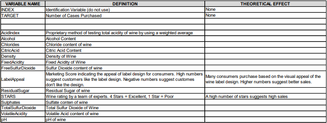

Source code: [https://github.com/djlofland/DS621_F2020_Group3/tree/master/Homework_5](https://github.com/djlofland/DS621_F2020_Group3/tree/master/Homework_5)

```{r setup, include=FALSE}
knitr::opts_chunk$set(echo = FALSE, warning = FALSE)
```

```{r echo=FALSE, message=FALSE, warning=FALSE, include=FALSE, paged.print=FALSE}
library(MASS)
library(rpart.plot)
library(ggplot2)
library(ggfortify)
library(gridExtra)
library(forecast)
library(fpp2)
library(fma)
library(kableExtra)
library(e1071)
library(mlbench)
library(ggcorrplot)
library(DataExplorer)
library(timeDate)
library(caret)
library(GGally)
library(corrplot)
library(RColorBrewer)
library(tibble)
library(tidyr)
library(tidyverse)
library(dplyr)
library(reshape2)
library(mixtools)
library(tidymodels)
library(ggpmisc)
library(regclass)
library(skimr)

#' Print a side-by-side Histogram and QQPlot of Residuals
#'
#' @param model A model
#' @examples
#' residPlot(myModel)
#' @return null
#' @export
residPlot <- function(model) {
  # Make sure a model was passed
  if (is.null(model)) {
    return
  }
  
  layout(matrix(c(1,1,2,3), 2, 2, byrow = TRUE))
  plot(residuals(model))
  hist(model[["residuals"]], freq = FALSE, breaks = "fd", main = "Residual Histogram",
       xlab = "Residuals",col="lightgreen")
  lines(density(model[["residuals"]], kernel = "ep"),col="blue", lwd=3)
  curve(dnorm(x,mean=mean(model[["residuals"]]), sd=sd(model[["residuals"]])), col="red", lwd=3, lty="dotted", add=T)
  qqnorm(model[["residuals"]], main = "Residual Q-Q plot")
  qqline(model[["residuals"]],col="red", lwd=3, lty="dotted")
  par(mfrow = c(1, 1))
}
#' Print a Variable Importance Plot for the provided model
#'
#' @param model The model
#' @param chart_title The Title to show on the plot
#' @examples
#' variableImportancePlot(myLinearModel, 'My Title)
#' @return null
#' @export
variableImportancePlot <- function(model=NULL, chart_title='Variable Importance Plot') {
  # Make sure a model was passed
  if (is.null(model)) {
    return
  }
  
  # use caret and gglot to print a variable importance plot
  varImp(model) %>% as.data.frame() %>% 
    ggplot(aes(x = reorder(rownames(.), desc(Overall)), y = Overall)) +
    geom_col(aes(fill = Overall)) +
    theme(panel.background = element_blank(),
          panel.grid = element_blank(),
          axis.text.x = element_text(angle = 90)) +
    scale_fill_gradient() +
    labs(title = chart_title,
         x = "Parameter",
         y = "Relative Importance")
}
#' Print a Facet Chart of histograms
#'
#' @param df Dataset
#' @param box Facet size (rows)
#' @examples
#' histbox(my_df, 3)
#' @return null
#' @export
histbox <- function(df, box) {
    par(mfrow = box)
    ndf <- dimnames(df)[[2]]
    
    for (i in seq_along(ndf)) {
            data <- na.omit(unlist(df[, i]))
            hist(data, breaks = "fd", main = paste("Histogram of", ndf[i]),
                 xlab = ndf[i], freq = FALSE)
            lines(density(data, kernel = "ep"), col = 'red')
    }
    
    par(mfrow = c(1, 1))
}
#' Extract key performance results from a model
#'
#' @param model A linear model of interest
#' @examples
#' model_performance_extraction(my_model)
#' @return data.frame
#' @export
model_performance_extraction <- function(model=NULL) {
  # Make sure a model was passed
  if (is.null(model)) {
    return
  }
  
  data.frame("RSE" = model$sigma,
             "Adj R2" = model$adj.r.squared,
             "F-Statistic" = model$fstatistic[1])
}
```

## Overview

The wine dataset is a highly popular one in the data science community, as it models some of the challenges of real world datasets and can be modeled by a variety of different model types.

We will first explore the data looking for issues or challenges (i.e. missing data, outliers, possible coding errors, multicollinearlity, etc).  Once we have a handle on the data, we will apply any necessary cleaning steps.  Once we have a reasonable dataset to work with, we will build and evaluate three different linear models that predict sales.  Our dataset includes both training data and evaluation data - we will train using the main training data, then evaluate models based on how well they perform against the holdout evaluation data.  Finally we will select a final model that offers the best compromise between accuracy and simplicity. 


## 1. Data Exploration

### Dataset

The wine training set contains 16 columns - including the target variable `TARGET` - and 12795 rows, covering a variety of different brands of wine. The data-set is entirely numerical variables, but also contains some variables that are highly discrete and have a limited number of possible values. We believe it is still reasonable to treat these as numerical variables since the different values follow a natural numerical order.

Below, we created a chart that describes each variable in the dataset and the theoretical effect it will have on the number of wins projected for a team.

```{r load_data, echo=FALSE}
# Load Wine dataset
df <- read.csv('https://raw.githubusercontent.com/djlofland/DS621_F2020_Group3/master/Homework_5/datasets/wine-training-data.csv', fileEncoding="UTF-8-BOM")
df_eval <- read.csv('https://raw.githubusercontent.com/djlofland/DS621_F2020_Group3/master/Homework_5/datasets/wine-evaluation-data.csv')
```




Given that the Index column had no impact on the target variable, number of wines, it was dropped. 

```{r echo=FALSE}
# Drop the INDEX column - this won't be useful
df <- df %>% 
  dplyr::select(-INDEX)

df_eval <- df_eval %>% 
  dplyr::select(-IN)
```


### Summary Stats

We compiled summary statistics on our data set to better understand the data before modeling. 


```{r echo=FALSE}
# Display summary statistics
summary(df)
```

The first observation is the prevalance of NA's throughout the dataset. Of the 14 feature columns, 8 of them contain at least some NA values. We also see that the `TARGET` value is always between 0 and 8, which makes sense as this is the "Number of Cases of Wine Sold" (we would not expect partial cases). 

We also note that many of the numerical features measuring the quantity of a chemical in the wine have a negative minimum value.  We are assuming the original chemical measurements were normalized (possible a log transform) allowing for negative values, since technically negative concentrations shouldn't be physically possible.  As such, we chose to leave those values as-is.  


### Distributions

Next, we wanted to get an idea of the distribution profiles for each of the variables. 


```{r, fig.height = 10, fig.width = 10, echo=FALSE}
# Prepare data for ggplot
gather_df <- df %>% 
  gather(key = 'variable', value = 'value')

# Histogram plots of each variable
ggplot(gather_df) + 
  geom_histogram(aes(x=value, y = ..density..), bins=30) + 
  geom_density(aes(x=value), color='blue') +
  facet_wrap(. ~variable, scales='free', ncol=4)
```

We see that most variables have a somewhat normal (although steep) distribution.

The distribution profiles show right skew in variables `AcidIndex`, and `STARS`. 

More interesting is the shape of many features where they are centered with most values clustered at the center and somewhat uniform shape above and below.  It almost appears like a tri-modal distribution with a low, middle and high normal distributions overlapping.  We are not going to do extensive feature engineering, or we might consider breaking these features up into 3 separate features each.  Two approaches include: 

1. Use `mixTools` to separate the multi-modal curves into 3 distinct (and separate) features each capturing just the `low`, `middle` or `high` values and retaining a numerical value.
2. Discretize the features converting them into categorical values indicating `low`, `middle` or `high` value.

### Boxplots

In addition to creating histogram distributions, we also elected to use box-plots to get an idea of the spread of each variable. 

```{r, fig.height = 10, fig.width = 10, echo=FALSE}
# Prepare data for ggplot
gather_df <- df %>% 
  gather(key = 'variable', value = 'value')

# Boxplots for each variable
ggplot(gather_df, aes(variable, value)) + 
  geom_boxplot() + 
  facet_wrap(. ~variable, scales='free', ncol=6)
```

```{r echo=F}
df_character_wide <- df %>% 
  select(TARGET, STARS, LabelAppeal, AcidIndex) %>%
  pivot_longer(cols = -TARGET, names_to="variable", values_to="value") %>%
  arrange(variable, value)

df_character_wide %>% 
  ggplot(mapping = aes(x = factor(value), y = TARGET)) +
    geom_boxplot() + 
    facet_wrap(.~variable, scales="free") +
    theme_bw() +
    theme(axis.text.x = element_text(angle = 90))
```


The box-plots do not reveal any enormous outliers in any of the features, meaning it is unlikely we will need to perform outlier detection and removal.  `AcidIndex`, `LabelAppeal`, and `STARS` are essentially categorical in nature (ordinal), so we explore how each value of those features relates with `TARGET`.  We see a clear relationship - as `LabelAppeal` increases, so does `TARGET`.  

We see the same relationship between `STARS` and `TARGET` - we especially note that `STARS=NA` highly correlates with lower `TARGET`.  In the original project instructions, attention was drawn to the fact that missing data might be informative.  Based on this, we will impute `STARS=NA` into `STARS=0` which fits with the other values we see for `STARS` and the pattern that as stars increase, cases sold increase.

### Variable Plots

Finally, we wanted to plot scatter plots of each variable versus the target variable, TARGET, to get an idea of the relationship between them. 

```{r, fig.height = 10, fig.width = 10, echo=FALSE}
# Plot scatter plots of each variable versus the target variable
featurePlot(df[,2:ncol(df)], df[,1], pch = 20)
```

Due to the discrete nature of the target, it is somewhat difficult to see clear linear relationships in the data. However, it does appear that both `STARS` and `LabelAppeal` have a significant positive relationship with the `TARGET`, and many of the chemical features have at least some negative relationship with the `TARGET` as lower values led to more values of 8 and 7 in the target variable.

Overall, although our plots indicate some interesting relationships between our variables, they also reveal some significant issues with the data. 

For instance, there are many data points that contain missing data that will need to be either imputed or discarded. There also was the issue of nonsensical negative values for variables measuring a concentration; we have chosen to assume that these variables have been log transformed and these values are not in error. However, there is no evidence to back up this decision, and we would need to reevaluate if given more information on the data collection/transformation process.

### Missing Data

When we initially viewed the first few rows of the raw data, we already noticed missing data.  Let's assess which fields have missing data.

```{r echo=FALSE} 
# Identify missing data by Feature and display percent breakout
missing <- colSums(df %>% sapply(is.na))
missing_pct <- round(missing / nrow(df) * 100, 2)
stack(sort(missing_pct, decreasing = TRUE))
```

In the project description, it was noted that the fact that a certain variable is missing may be predictive. We will impute `STARS=NA` to `STARS=0`. We will impute the remaining missing data using `caret::preProcess` and `method=knnImpute`.  Note that `preProcess` will also center, scale and `BoxCox` our features at the same time.

```{r}
# separate our features from target so we don't inadvertently transform the target
training_x <- df %>% select(-TARGET)
training_y <- df$TARGET

# separate our features from target so we don't inadvertently transform the target
eval_x <- df_eval %>% select(-TARGET)
eval_y <- df_eval$TARGET

create_na_dummy <- function(vector) {
  as.integer(vector %>% is.na())
}

impute_missing <- function(data) {
  # Replace missing STARS with 0 
  data$STARS <- data$STARS %>%
    replace_na(0)

  return(data)
}

# Replace missing STARS with 'unknown' and convert STASR to a factor
training_x <- impute_missing(training_x)
eval_x <- impute_missing(eval_x)

imputation <- preProcess(training_x, method = c("knnImpute", 'BoxCox'))
# summary(imputation)

training_x_imp <- predict(imputation, training_x)
eval_x_imp <- predict(imputation, eval_x)

clean_df <- cbind(training_y, training_x_imp) %>% 
  as.data.frame() %>%
  rename(TARGET = training_y)

clean_eval_df <- cbind(eval_y, eval_x_imp) %>% 
  as.data.frame() %>%
  rename(TARGET = eval_y)
  
```

### Feature-Target Correlations

With our missing data imputed correctly, we can now build off the scatter plots from above to quantify the correlations between our target variable and predictor variable. We will want to choose those with stronger positive or negative correlations.  Features with correlations closer to zero will probably not provide any meaningful information on explaining wins by a team.

```{r echo=FALSE}
# Show feature correlations/target by decreasing correlation
stack(sort(cor(clean_df[,1], clean_df[,2:ncol(clean_df)])[,], decreasing=TRUE))
```

`STARS`, `LabelAppeal`, and `AcidIndex` have the highest correlation with `TARGET`, which matches what we saw in the variable plots above. Recall that we imputed `NA` values for `STARS` as `0`. 

### Multicolinearity

One problem that can occur with multi-variable regression is correlation between variables, or multicolinearity. A quick check is to run correlations between variables.   

```{r echo=FALSE, fig.height=8}
# Calculate and plot the Multicolinearity
correlation = cor(clean_df, use = 'pairwise.complete.obs')
corrplot(correlation, 'ellipse', type = 'lower', order = 'hclust',
         col=brewer.pal(n=8, name="RdYlBu"))
```

We see that the features have very low correlations with each other, meaning that there is not much multicollinearity present in the dataset. This means that the assumptions of linear regression are more likely to be met.

## 2. Data Preparation

To summarize our data preparation and exploration, we can distinguish our findings into a few categories below:

### Removed Fields

We removed the INDEX field as it offers no information for a model.  

### Missing Values

For the STARS field, we imputed NAs as the value of 0, since missing values were highly correlated with the target variable. For other fields with missing values, we imputed their value using caret's knnimpute.

### Outliers

Many of the numerical features have somewhat unreasonable negative values, but we are choosing to believe that these are log-transformed variables and that the values are legitimate.

### Transform non-normal variables

Finally, as mentioned earlier in our data exploration, during the impute step, `caret::preProcess()` automatically centered, scaled and BoxCox transformed our data.  Here are some plots to demonstrate the changes in distributions and final values after the transformations:  

```{r echo=FALSE, fig.height=12, fig.width=10, message=FALSE, warning=FALSE}
# created empty data frame to store transformed variables
#df_temp <- data.frame(matrix(ncol = 1, nrow = length(clean_df$TARGET)))

# performed log transformation
#df_temp$Chlorides <- clean_df$Chlorides
#df_temp$Chlorides_transform <- log(clean_df$Chlorides)

# performed log transformation
#df_temp$CitricAcid <- clean_df$CitricAcid
#df_temp$CitricAcid_transform <- log(clean_df$CitricAcid)

# performed a log transformation
#df_temp$FixedAcidity <- clean_df$FixedAcidity
#df_temp$FixedAcidity_transform <- log(clean_df$FixedAcidity)
# performed a log transformation
#df_temp$FreeSulfurDioxide <- clean_df$FreeSulfurDioxide
#df_temp$FreeSulfurDioxide_transform <- log(clean_df$FreeSulfurDioxide)
# performed a log transformation
#df_temp$ResidualSugar <- clean_df$ResidualSugar
#df_temp$ResidualSugar_transform <- log(clean_df$ResidualSugar)
# performed a log transformation
#df_temp$Sulphates <- clean_df$Sulphates
#df_temp$Sulphates_transform <- log(clean_df$Sulphates)
# performed a log transformation
#df_temp$TotalSulfurDioxide <- clean_df$TotalSulfurDioxide
#df_temp$TotalSulfurDioxide_transform <- log(clean_df$TotalSulfurDioxide)
# performed a log transformation
#df_temp$VolatileAcidity <- clean_df$VolatileAcidity
#df_temp$VolatileAcidity_transform <- log(clean_df$VolatileAcidity)
#df_temp <- df_temp[, 2:17]
histbox(clean_df, c(6, 3))
# performed boxcox transformation after identifying proper lambda
#df_temp$BATTING_HR <- clean_df$BATTING_HR
#battingHR_lambda <- BoxCox.lambda(clean_df$BATTING_HR)
#df_temp$BATTING_HR_transform <- BoxCox(clean_df$BATTING_HR, battingHR_lambda)
```

We see that after the transformations, the variables are more centered and more closely resemble a normal distribution, although clearly they are still not perfect normal distributions.

### Finalizing the dataset for model building 

With our transformations complete, we can now add these into our `clean_df` dataframe and continue on to build our models.  To better measure each model performance, we split our data into a training and testing data set.  We will train using the first, then measure model performance again the testing hold out set.

```{r echo=F}
options(scipen = 999)

#75% data test training split
# get training/test split
y_raw <- as.matrix(clean_df$TARGET)
trainingRows <- createDataPartition(y_raw, p=0.8, list=FALSE)

# Build training data sets
trainX <- clean_df[trainingRows,] %>% select(-TARGET)
trainY <- clean_df[trainingRows,] %>% select(TARGET)

# put remaining rows into the test sets
testX <- clean_df[-trainingRows,] %>% select(-TARGET)
testY <- clean_df[-trainingRows,] %>% select(TARGET)

# Build a DF
trainingData <- as.data.frame(trainX)
trainingData$TARGET <- trainY$TARGET
print(paste('Number of Training Samples: ', dim(trainingData)[1]))

testingData <- as.data.frame(testX)
testingData$TARGET <- testY$TARGET
print(paste('Number of Testing Samples: ', dim(testingData)[1]))

model_test_perf <- function(model, trainX, trainY, testX, testY) {
  # Evaluate Model 1 with testing data set
  predictedY <- predict(model, newdata=trainX)

  model_results <- data.frame(obs = trainY, pred=predictedY)
  colnames(model_results) = c('obs', 'pred')
  
  # This grabs RMSE, Rsquaredand MAE by default
  model_eval <- defaultSummary(model_results)
  
  # Add AIC score to the results
  if ('aic' %in% model) {
    model_eval[4] <- model$aic
  } else {
    model_eval[4] <- AIC(model)
  }
  
  names(model_eval)[4] <- 'aic'
 
  # Add BIC score to the results
  model_eval[5] <- BIC(model)
  names(model_eval)[5] <- 'bic'

   
  return(model_eval)
}
```

## 3. Model Building

### Poisson Model 1

In this first model, we include all available features. Features include:

`FixedAcidity`, `VolatileAcidity`, `CitricAcid`, `ResidualSugar`, `Chlorides`, `FreeSulfurDioxide`, `TotalSulfurDioxide`, `Density`, `pH`, `Sulphates`, `Alcohol`, `LabelAppeal`, `AcidIndex`, `STARS`

```{r echo=F}
options(scipen = 999)

poiss1 <- glm(TARGET ~ FixedAcidity + VolatileAcidity + CitricAcid + ResidualSugar + 
                Chlorides + FreeSulfurDioxide + TotalSulfurDioxide + Density +
                pH + Sulphates + Alcohol + 
                as.factor(LabelAppeal) +
                as.factor(AcidIndex) +
                as.factor(STARS),
              data=trainingData, 
              family=poisson)

summary(poiss1)

# Evaluate Model 1 with testing data set
(poiss1_eval <- model_test_perf(poiss1, trainX, trainY, testX, testY))
po1VIP <- variableImportancePlot(poiss1, "Poisson Model 1 Variable Importance")
```

### Poisson Model 2

In this second model, we only include the most predictive features based on our first Poisson Model.  The predictors for the following model are:

`VolatileAcidity`, `TotalSulfurDioxide`, `Alcohol`, `LabelAppeal`, `AcidIndex`, `STARS`

```{r echo=F}

poiss2 <- glm(TARGET ~ VolatileAcidity + TotalSulfurDioxide + Alcohol + 
                as.factor(LabelAppeal) + 
                as.factor(AcidIndex) + 
                as.factor(STARS),
              data=clean_df, 
              family=poisson)

summary(poiss2)

# Evaluate Model 1 with testing data set
(poiss2_eval <- model_test_perf(poiss2, trainX, trainY, testX, testY))
po2VIP <- variableImportancePlot(poiss2, "Poisson Model 2 Variable Importance")
```


### Negative Binomial Model 3

Similar to Poisson Model 1, the predictors for the following model are:

`FixedAcidity`, `VolatileAcidity`, `CitricAcid`, `ResidualSugar`, `Chlorides`, `FreeSulfurDioxide`, `TotalSulfurDioxide`, `Density`, `pH`, `Sulphates`, `Alcohol`, `LabelAppeal`, `AcidIndex`, `STARS`

```{r echo=F}
nb3 <- glm.nb(TARGET ~ FixedAcidity + VolatileAcidity + CitricAcid + ResidualSugar + 
                Chlorides + FreeSulfurDioxide + TotalSulfurDioxide + Density +
                pH + Sulphates + Alcohol + 
                as.factor(LabelAppeal) +
                as.factor(AcidIndex) +
                as.factor(STARS),
              data=clean_df)
summary(nb3)

# Evaluate Model 1 with testing data set
(nb3_eval <- model_test_perf(nb3, trainX, trainY, testX, testY))
nb3VIP <- variableImportancePlot(nb3, "Negative Binomial 3 Variable Importance")
```


### Negative Binomial Model 4

Similar to Poisson Model 2, the predictors for the following model are:

`VolatileAcidity`, `FreeSulfurDioxide`, `TotalSulfurDioxide`, `Alcohol`, `LabelAppeal`, `AcidIndex`, `STARS`

```{r echo=F}

nb4 <- glm.nb(TARGET~ VolatileAcidity + FreeSulfurDioxide + TotalSulfurDioxide + Alcohol +
                as.factor(LabelAppeal) +
                as.factor(AcidIndex) + 
                as.factor(STARS),
              data=clean_df)

summary (nb4)

# Evaluate Model 1 with testing data set
(nb4_eval <- model_test_perf(nb4, trainX, trainY, testX, testY))
nb4VIP <- variableImportancePlot(nb4, "Negative Binomial 4 Variable Importance")
```

### Linear Model 5

The predictors for the following model are:

`FixedAcidity`, `VolatileAcidity`, `CitricAcid`, `ResidualSugar`, `Chlorides`, `FreeSulfurDioxide`, `TotalSulfurDioxide`, `Density`, `pH`, `Sulphates`, `Alcohol`, `LabelAppeal`, `AcidIndex`, `STARS`

```{r echo=FALSE}
lm5 <- lm(TARGET ~ FixedAcidity + VolatileAcidity + CitricAcid + ResidualSugar + 
                Chlorides + FreeSulfurDioxide + TotalSulfurDioxide + Density +
                pH + Sulphates + Alcohol + 
                as.factor(LabelAppeal) +
                as.factor(AcidIndex) +
                as.factor(STARS),
              data=clean_df)

summary(lm5)

# Evaluate Model 1 with testing data set
(lm5_eval <- model_test_perf(lm5, trainX, trainY, testX, testY))
lm5VIP <- variableImportancePlot(lm5, "Linear Model 5 Variable Importance")
```

### Linear Model 6

For the final Linear Model, we leverage `stepAIC` on our Linear Model #5 to choose the most important features.

```{r echo=FALSE}
lm6 <- stepAIC(lm5, direction = "both",
               scope = list(upper = lm5, lower = ~ 1),
               scale = 0, trace = FALSE)

summary(lm6)

# Evaluate Model 1 with testing data set
(lm6_eval <- model_test_perf(lm6, trainX, trainY, testX, testY))

lm6VIP <- variableImportancePlot(lm6, "Linear Model 6 Variable Importance")
```

## 4. Model Selection & Analysis

This table summarizes the **RMSE**, **$R^2$**, **MAE**, **AIC** and **BIC** for all 6 models.  In terms of raw metrics, The Linear regressions (**Linear Model 5** and **Linear Model 6**) had the overall best performance based on **RMSE** and **$R^2$**; however, **Poisson Model 1** had the best performance based on **AIC** and **BIC**.  

Overall, **RMSE** an **$R^2$** were not largely different across the 6 models, given this we chose **Poisson Model 1** as our final model since it had a far lower **AIC**.

```{r echo=F}
models_summary <- rbind(poiss1_eval, poiss2_eval, nb3_eval, nb4_eval, lm5_eval, lm6_eval)

kable(models_summary) %>% 
  kable_styling(bootstrap_options = "basic", position = "center")
```

The final thing we will take a look at is our variable importance for each model.

The final figure presented below shows the feature importance in each model. As we see, all 6 models identified the same top 10 features.   

```{r, fig.width=8, fig.height=12}
grid.arrange(po1VIP, po2VIP, nb3VIP, nb4VIP, lm5VIP, lm6VIP, ncol = 2)
```


## Predictions

We apply **Poisson Model #1** to the holdout evaluation set to predict the `TARGET` for these instances. We have saved these predictions as csv in the file `eval_predictions.csv`.

Source code: [https://github.com/djlofland/DS621_F2020_Group3/tree/master/Homework_5/eval_predictions.csv](https://github.com/djlofland/DS621_F2020_Group3/tree/master/Homework_5/eval_predictions.csv)

```{r, echo=F}
eval_data <- clean_eval_df %>% select(-TARGET)

predictions <- predict(poiss1, eval_data)
clean_eval_df$TARGET <- predictions

write.csv(clean_eval_df, 'eval_predictions.csv', row.names=F)

head(clean_eval_df)
```

## References

- A Modern Approach to Regression with R: Simon Sheather
- Linear Models with R: Julian Faraway. 
- R package vignette, [mixtools: An R Package for Analyzing Finite Mixture Models](https://cran.r-project.org/web/packages/mixtools/vignettes/mixtools.pdf)
- [7 Classic OLS assumptions](https://statisticsbyjim.com/regression/ols-linear-regression-assumptions/)
- [Detecting Multicolinearity with VIF](https://online.stat.psu.edu/stat462/node/180/)


## Appendix

### R Code

```
# =====================================================================================
# Load Libraries and Define Helper functions 
# =====================================================================================

library(MASS)
library(rpart.plot)
library(ggplot2)
library(ggfortify)
library(gridExtra)
library(forecast)
library(fpp2)
library(fma)
library(kableExtra)
library(e1071)
library(mlbench)
library(ggcorrplot)
library(DataExplorer)
library(timeDate)
library(caret)
library(GGally)
library(corrplot)
library(RColorBrewer)
library(tibble)
library(tidyr)
library(tidyverse)
library(dplyr)
library(reshape2)
library(mixtools)
library(tidymodels)
library(ggpmisc)
library(regclass)
library(skimr)

#' Print a side-by-side Histogram and QQPlot of Residuals
#'
#' @param model A model
#' @examples
#' residPlot(myModel)
#' @return null
#' @export
residPlot <- function(model) {
  # Make sure a model was passed
  if (is.null(model)) {
    return
  }
  
  layout(matrix(c(1,1,2,3), 2, 2, byrow = TRUE))
  plot(residuals(model))
  hist(model[["residuals"]], freq = FALSE, breaks = "fd", main = "Residual Histogram",
       xlab = "Residuals",col="lightgreen")
  lines(density(model[["residuals"]], kernel = "ep"),col="blue", lwd=3)
  curve(dnorm(x,mean=mean(model[["residuals"]]), sd=sd(model[["residuals"]])), col="red", lwd=3, lty="dotted", add=T)
  qqnorm(model[["residuals"]], main = "Residual Q-Q plot")
  qqline(model[["residuals"]],col="red", lwd=3, lty="dotted")
  par(mfrow = c(1, 1))
}
#' Print a Variable Importance Plot for the provided model
#'
#' @param model The model
#' @param chart_title The Title to show on the plot
#' @examples
#' variableImportancePlot(myLinearModel, 'My Title)
#' @return null
#' @export
variableImportancePlot <- function(model=NULL, chart_title='Variable Importance Plot') {
  # Make sure a model was passed
  if (is.null(model)) {
    return
  }
  
  # use caret and gglot to print a variable importance plot
  varImp(model) %>% as.data.frame() %>% 
    ggplot(aes(x = reorder(rownames(.), desc(Overall)), y = Overall)) +
    geom_col(aes(fill = Overall)) +
    theme(panel.background = element_blank(),
          panel.grid = element_blank(),
          axis.text.x = element_text(angle = 90)) +
    scale_fill_gradient() +
    labs(title = chart_title,
         x = "Parameter",
         y = "Relative Importance")
}
#' Print a Facet Chart of histograms
#'
#' @param df Dataset
#' @param box Facet size (rows)
#' @examples
#' histbox(my_df, 3)
#' @return null
#' @export
histbox <- function(df, box) {
    par(mfrow = box)
    ndf <- dimnames(df)[[2]]
    
    for (i in seq_along(ndf)) {
            data <- na.omit(unlist(df[, i]))
            hist(data, breaks = "fd", main = paste("Histogram of", ndf[i]),
                 xlab = ndf[i], freq = FALSE)
            lines(density(data, kernel = "ep"), col = 'red')
    }
    
    par(mfrow = c(1, 1))
}
#' Extract key performance results from a model
#'
#' @param model A linear model of interest
#' @examples
#' model_performance_extraction(my_model)
#' @return data.frame
#' @export
model_performance_extraction <- function(model=NULL) {
  # Make sure a model was passed
  if (is.null(model)) {
    return
  }
  
  data.frame("RSE" = model$sigma,
             "Adj R2" = model$adj.r.squared,
             "F-Statistic" = model$fstatistic[1])
}

# =====================================================================================
# Load Data set
# =====================================================================================

# Load Wine dataset
df <- read.csv('https://raw.githubusercontent.com/djlofland/DS621_F2020_Group3/master/Homework_5/datasets/wine-training-data.csv', fileEncoding="UTF-8-BOM")
df_eval <- read.csv('https://raw.githubusercontent.com/djlofland/DS621_F2020_Group3/master/Homework_5/datasets/wine-evaluation-data.csv')

# =====================================================================================
# Summary Stats 
# =====================================================================================

# Display summary statistics
summary(df)

# =====================================================================================
# Distributions
# =====================================================================================

# Prepare data for ggplot
gather_df <- df %>% 
  gather(key = 'variable', value = 'value')

# Histogram plots of each variable
ggplot(gather_df) + 
  geom_histogram(aes(x=value, y = ..density..), bins=30) + 
  geom_density(aes(x=value), color='blue') +
  facet_wrap(. ~variable, scales='free', ncol=4)
     
# =====================================================================================
# Boxplots 
# =====================================================================================

# Prepare data for ggplot
gather_df <- df %>% 
  gather(key = 'variable', value = 'value')

# Boxplots for each variable
ggplot(gather_df, aes(variable, value)) + 
  geom_boxplot() + 
  facet_wrap(. ~variable, scales='free', ncol=6)
  
df_character_wide <- df %>% 
  select(TARGET, STARS, LabelAppeal, AcidIndex) %>%
  pivot_longer(cols = -TARGET, names_to="variable", values_to="value") %>%
  arrange(variable, value)

df_character_wide %>% 
  ggplot(mapping = aes(x = factor(value), y = TARGET)) +
    geom_boxplot() + 
    facet_wrap(.~variable, scales="free") +
    theme_bw() +
    theme(axis.text.x = element_text(angle = 90))

# =====================================================================================
# Variable Plots
# =====================================================================================
  
# Plot scatter plots of each variable versus the target variable
featurePlot(df[,2:ncol(df)], df[,1], pch = 20)


# =====================================================================================
# Missing Data 
# =====================================================================================

# Identify missing data by Feature and display percent breakout
missing <- colSums(df %>% sapply(is.na))
missing_pct <- round(missing / nrow(df) * 100, 2)
stack(sort(missing_pct, decreasing = TRUE))

# separate our features from target so we don't inadvertently transform the target
training_x <- df %>% select(-TARGET)
training_y <- df$TARGET

# separate our features from target so we don't inadvertently transform the target
eval_x <- df_eval %>% select(-TARGET)
eval_y <- df_eval$TARGET

create_na_dummy <- function(vector) {
  as.integer(vector %>% is.na())
}

impute_missing <- function(data) {
  # Replace missing STARS with 0 
  data$STARS <- data$STARS %>%
    replace_na(0)

  return(data)
}

# Replace missing STARS with 'unknown' and convert STASR to a factor
training_x <- impute_missing(training_x)
eval_x <- impute_missing(eval_x)

imputation <- preProcess(training_x, method = c("knnImpute", 'BoxCox'))
# summary(imputation)

training_x_imp <- predict(imputation, training_x)
eval_x_imp <- predict(imputation, eval_x)

clean_df <- cbind(training_y, training_x_imp) %>% 
  as.data.frame() %>%
  rename(TARGET = training_y)

clean_eval_df <- cbind(eval_y, eval_x_imp) %>% 
  as.data.frame() %>%
  rename(TARGET = eval_y)
  
# =====================================================================================
# Feature-target correlations
# =====================================================================================
  
# Show feature correlations/target by decreasing correlation
stack(sort(cor(clean_df[,1], clean_df[,2:ncol(clean_df)])[,], decreasing=TRUE))


# =====================================================================================
# Multicolinearity
# =====================================================================================

# Calculate and plot the Multicolinearity
correlation = cor(clean_df, use = 'pairwise.complete.obs')
corrplot(correlation, 'ellipse', type = 'lower', order = 'hclust',
         col=brewer.pal(n=8, name="RdYlBu"))
         

# =====================================================================================
# Transform non-normal variables
# =====================================================================================

# created empty data frame to store transformed variables
#df_temp <- data.frame(matrix(ncol = 1, nrow = length(clean_df$TARGET)))

# performed log transformation
#df_temp$Chlorides <- clean_df$Chlorides
#df_temp$Chlorides_transform <- log(clean_df$Chlorides)

# performed log transformation
#df_temp$CitricAcid <- clean_df$CitricAcid
#df_temp$CitricAcid_transform <- log(clean_df$CitricAcid)

# performed a log transformation
#df_temp$FixedAcidity <- clean_df$FixedAcidity
#df_temp$FixedAcidity_transform <- log(clean_df$FixedAcidity)
# performed a log transformation
#df_temp$FreeSulfurDioxide <- clean_df$FreeSulfurDioxide
#df_temp$FreeSulfurDioxide_transform <- log(clean_df$FreeSulfurDioxide)
# performed a log transformation
#df_temp$ResidualSugar <- clean_df$ResidualSugar
#df_temp$ResidualSugar_transform <- log(clean_df$ResidualSugar)
# performed a log transformation
#df_temp$Sulphates <- clean_df$Sulphates
#df_temp$Sulphates_transform <- log(clean_df$Sulphates)
# performed a log transformation
#df_temp$TotalSulfurDioxide <- clean_df$TotalSulfurDioxide
#df_temp$TotalSulfurDioxide_transform <- log(clean_df$TotalSulfurDioxide)
# performed a log transformation
#df_temp$VolatileAcidity <- clean_df$VolatileAcidity
#df_temp$VolatileAcidity_transform <- log(clean_df$VolatileAcidity)

# =====================================================================================
# Finalizing dataset for model building
# =====================================================================================

options(scipen = 999)

#75% data test training split
# get training/test split
y_raw <- as.matrix(clean_df$TARGET)
trainingRows <- createDataPartition(y_raw, p=0.8, list=FALSE)

# Build training data sets
trainX <- clean_df[trainingRows,] %>% select(-TARGET)
trainY <- clean_df[trainingRows,] %>% select(TARGET)

# put remaining rows into the test sets
testX <- clean_df[-trainingRows,] %>% select(-TARGET)
testY <- clean_df[-trainingRows,] %>% select(TARGET)

# Build a DF
trainingData <- as.data.frame(trainX)
trainingData$TARGET <- trainY$TARGET
print(paste('Number of Training Samples: ', dim(trainingData)[1]))

testingData <- as.data.frame(testX)
testingData$TARGET <- testY$TARGET
print(paste('Number of Testing Samples: ', dim(testingData)[1]))

model_test_perf <- function(model, trainX, trainY, testX, testY) {
  # Evaluate Model 1 with testing data set
  predictedY <- predict(model, newdata=trainX)

  model_results <- data.frame(obs = trainY, pred=predictedY)
  colnames(model_results) = c('obs', 'pred')
  
  # This grabs RMSE, Rsquaredand MAE by default
  model_eval <- defaultSummary(model_results)
  
  # Add AIC score to the results
  if ('aic' %in% model) {
    model_eval[4] <- model$aic
  } else {
    model_eval[4] <- AIC(model)
  }
  
  names(model_eval)[4] <- 'aic'
 
  # Add BIC score to the results
  model_eval[5] <- BIC(model)
  names(model_eval)[5] <- 'bic'

   
  return(model_eval)

# =====================================================================================
# Poisson Model 1
# =====================================================================================

options(scipen = 999)

poiss1 <- glm(TARGET ~ FixedAcidity + VolatileAcidity + CitricAcid + ResidualSugar + 
                Chlorides + FreeSulfurDioxide + TotalSulfurDioxide + Density +
                pH + Sulphates + Alcohol + 
                as.factor(LabelAppeal) +
                as.factor(AcidIndex) +
                as.factor(STARS),
              data=trainingData, 
              family=poisson)

summary(poiss1)

# Evaluate Model 1 with testing data set
(poiss1_eval <- model_test_perf(poiss1, trainX, trainY, testX, testY))
po1VIP <- variableImportancePlot(poiss1, "Poisson Model 1 Variable Importance")


# =====================================================================================
# Poisson Model 2
# =====================================================================================

poiss2 <- glm(TARGET ~ VolatileAcidity + TotalSulfurDioxide + Alcohol + 
                as.factor(LabelAppeal) + 
                as.factor(AcidIndex) + 
                as.factor(STARS),
              data=clean_df, 
              family=poisson)

summary(poiss2)

# Evaluate Model 1 with testing data set
(poiss2_eval <- model_test_perf(poiss2, trainX, trainY, testX, testY))
po2VIP <- variableImportancePlot(poiss2, "Poisson Model 2 Variable Importance")


# =====================================================================================
# Negative Binomial Model 3
# =====================================================================================

nb3 <- glm.nb(TARGET ~ FixedAcidity + VolatileAcidity + CitricAcid + ResidualSugar + 
                Chlorides + FreeSulfurDioxide + TotalSulfurDioxide + Density +
                pH + Sulphates + Alcohol + 
                as.factor(LabelAppeal) +
                as.factor(AcidIndex) +
                as.factor(STARS),
              data=clean_df)
summary(nb3)

# Evaluate Model 1 with testing data set
(nb3_eval <- model_test_perf(nb3, trainX, trainY, testX, testY))
nb3VIP <- variableImportancePlot(nb3, "Negative Binomial 3 Variable Importance")(model3$fit, "Linear Model 3")

# =====================================================================================
# Negative Binomial Model 4
# =====================================================================================

nb4 <- glm.nb(TARGET~ VolatileAcidity + FreeSulfurDioxide + TotalSulfurDioxide + Alcohol +
                as.factor(LabelAppeal) +
                as.factor(AcidIndex) + 
                as.factor(STARS),
              data=clean_df)

summary (nb4)

# Evaluate Model 1 with testing data set
(nb4_eval <- model_test_perf(nb4, trainX, trainY, testX, testY))
nb4VIP <- variableImportancePlot(nb4, "Negative Binomial 4 Variable Importance")

# =====================================================================================
# Linear Model 5
# =====================================================================================

lm5 <- lm(TARGET ~ FixedAcidity + VolatileAcidity + CitricAcid + ResidualSugar + 
                Chlorides + FreeSulfurDioxide + TotalSulfurDioxide + Density +
                pH + Sulphates + Alcohol + 
                as.factor(LabelAppeal) +
                as.factor(AcidIndex) +
                as.factor(STARS),
              data=clean_df)

summary(lm5)

# Evaluate Model 1 with testing data set
(lm5_eval <- model_test_perf(lm5, trainX, trainY, testX, testY))
lm5VIP <- variableImportancePlot(lm5, "Linear Model 5 Variable Importance")

# =====================================================================================
# Linear Model 6
# =====================================================================================

lm6 <- stepAIC(lm5, direction = "both",
               scope = list(upper = lm5, lower = ~ 1),
               scale = 0, trace = FALSE)

summary(lm6)

# Evaluate Model 1 with testing data set
(lm6_eval <- model_test_perf(lm6, trainX, trainY, testX, testY))

lm6VIP <- variableImportancePlot(lm6, "Linear Model 6 Variable Importance")


# =====================================================================================
Model selection and analysis
# =====================================================================================


models_summary <- rbind(poiss1_eval, poiss2_eval, nb3_eval, nb4_eval, lm5_eval, lm6_eval)

kable(models_summary) %>% 
  kable_styling(bootstrap_options = "basic", position = "center")
  
grid.arrange(po1VIP, po2VIP, nb3VIP, nb4VIP, lm5VIP, lm6VIP, ncol = 2)

# =====================================================================================
Predictions
# =====================================================================================

eval_data <- clean_eval_df %>% select(-TARGET)

predictions <- predict(poiss1, eval_data)
clean_eval_df$TARGET <- predictions

write.csv(clean_eval_df, 'eval_predictions.csv', row.names=F)

head(clean_eval_df)
        
# =====================================================================================
End of R Code
# =====================================================================================
```
